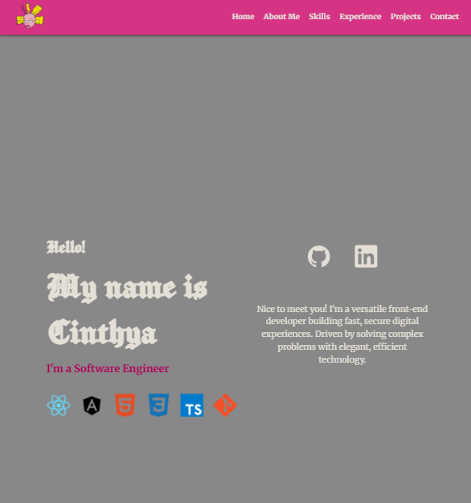

# Cinthya Lopez - Portfolio Website

A modern, responsive portfolio website showcasing my skills, experience, and projects as a Front-end Developer. Built with clean HTML and CSS with a focus on performance and accessibility.



## 🌟 Features

- **Responsive Design**: Fully responsive across all devices (mobile, tablet, desktop)
- **Modern UI/UX**: Clean, professional design with smooth animations
- **Performance Optimized**: Fast loading times and optimized assets
- **Accessibility**: WCAG compliant with proper semantic HTML and ARIA labels
- **Cross-browser Compatible**: Works seamlessly across all modern browsers
- **SEO Friendly**: Optimized for search engines

## 🛠️ Technologies Used

- **HTML5**: Semantic markup and modern web standards
- **CSS3**: Advanced styling with CSS Grid, Flexbox, and custom properties
- **Git**: Version control and project management
- **Font**: Google Fonts (Manufacturing Consent, Merriweather)

## 🎨 Design Features

- **Custom Color Scheme**: Dark theme with accent colors (#D70074, #8B004B)
- **Typography**: Professional font pairing for readability
- **Animations**: Subtle fade-in effects and hover animations
- **Icons**: Custom SVG icons for social media and skills
- **Layout**: Modern grid and flexbox layouts

## 📱 Responsive Breakpoints

- **Mobile**: 320px - 480px
- **Tablet**: 481px - 768px
- **Large Tablet**: 769px - 1024px
- **Desktop**: 1025px+
- **Large Desktop**: 1400px+

## 🚀 Quick Start

1. **Clone the repository**
   ```bash
   git clone https://github.com/ratzz-zz/personal-portfolio.git
   cd personal-portfolio
   ```

2. **Open in your browser**
   ```bash
   # Simply open index.html in your preferred browser
   open index.html
   # or use a local server (recommended)
   python -m http.server 8000
   # or with Node.js
   npx serve
   ```

3. **View the website**
   - Navigate to `http://localhost:8000` (if using a local server)
   - Or directly open `index.html` in your browser

## 📂 Project Structure

```
portfolio/
├── index.html              # Main HTML file
├── styles/
│   ├── styles.css          # Main stylesheet
│   ├── normalize.css       # CSS reset/normalize
│   └── src/
│       ├── cinthya-logo-2.png
│       ├── Project-1.png
│       ├── Project-2.png
│       └── Project-3.png
├── README.md              # Project documentation
└── .gitignore            # Git ignore file
```

## 🎯 Sections

### 1. **Welcome Section**
- Personal introduction and greeting
- Skill icons showcase (React, Angular, HTML, CSS, TypeScript, Git)
- Social media links (GitHub, LinkedIn)
- Professional description

### 2. **About Me**
- Professional background and experience
- Profile image
- Detailed personal and professional information

### 3. **Skills**
- **Front-end**: React/Angular, TypeScript, CSS/Sass, Tailwind CSS
- **UI/UX**: Figma, Responsive Design, Wireframing, Visual Design
- **Tools**: Git, VS Code/IntelliJ, Jest, Webpack

### 4. **Experience**
- **Front-end Jr Developer** at DADI Market (2023 - present)
- **Full-stack Developer** - Freelance (2024 - 2025)
- **Front-end Jr Developer** at Grupo Comercial PRONDE (2022 - 2023)

### 5. **Projects**
- Portfolio Website
- Product Landing Page
- Role Playing Game

### 6. **Contact**
- Contact form with email integration
- Contact information and response time
- Social media links
- Location information

## 🎨 Customization

### Colors
Update the CSS custom properties in `styles/styles.css`:

```css
:root {
    --color-text: #e4e0d7;
    --color-background: #1B1A1A;
    --color-accent: #D70074;
    --color-accent-light: #8B004B;
    --color-border: #3a3a3a;
}
```

### Fonts
The project uses Google Fonts. To change fonts, update the links in `index.html` and the CSS variables:

```css
:root {
    --font-title: 'Manufacturing Consent', sans-serif;
    --font-body: 'Merriweather', serif;
}
```

### Content
- Update personal information in `index.html`
- Replace project images in `styles/src/`
- Modify social media links
- Update contact information

## 🌐 Browser Support

- Chrome (latest)
- Firefox (latest)
- Safari (latest)
- Edge (latest)
- Internet Explorer 11+ (with polyfills)

## ♿ Accessibility Features

- Semantic HTML structure
- ARIA labels for interactive elements
- Keyboard navigation support
- Screen reader compatibility
- High contrast support
- Reduced motion support for users with vestibular disorders

## 📱 Mobile Optimization

- Touch-friendly interactive elements
- Optimized images for different screen densities
- Responsive typography scaling
- Mobile-first CSS approach
- Fast loading times on mobile networks

## 🚀 Performance Optimizations

- Optimized images and assets
- Minimal CSS and JavaScript
- Efficient CSS selectors
- Preloaded critical resources
- Lazy loading for non-critical content

## 🔧 Development

### Prerequisites
- Modern web browser
- Text editor (VS Code recommended)
- Git for version control

### Best Practices
- Use semantic HTML
- Follow BEM CSS methodology
- Maintain consistent code formatting
- Test across different browsers and devices
- Optimize images before adding to project

## 👤 Author

**Ratzz-zz**
- GitHub: [@ratzz-zz](https://github.com/ratzz-zz)

## 🤝 Contributing

1. Fork the project
2. Create your feature branch (`git checkout -b feature/AmazingFeature`)
3. Commit your changes (`git commit -m 'Add some AmazingFeature'`)
4. Push to the branch (`git push origin feature/AmazingFeature`)
5. Open a Pull Request

## 📈 Future Enhancements

- [ ] Add dark/light theme toggle
- [ ] Implement blog section
- [ ] Add project filtering functionality
- [ ] Integrate with a headless CMS
- [ ] Add more interactive animations
- [ ] Implement PWA features
- [ ] Add multi-language support

## 🙏 Acknowledgments

- Google Fonts for typography
- Design inspiration from modern portfolio websites
- Icon designs and SVG graphics
- Open source community for best practices

---

⭐ If you find this project helpful, please give it a star on GitHub!

**Last Updated**: December 2024

